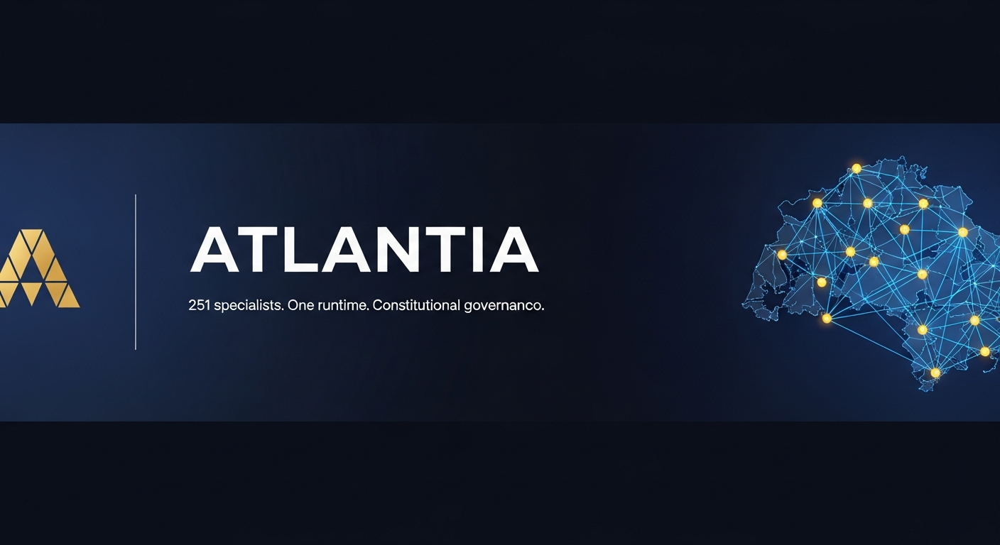

# Atlantia



**251 domain specialists. One runtime. Constitutional governance. Nothing copy-pasted.**

Atlantia merges two open-source projects into a single governed platform:

| Layer | Source |
|---|---|
| Persona library (232+ domain specialist agents) | Derived from agency-agents (MIT) |
| Multi-agent runtime, swarm orchestration, memory, model routing | Ruflo (MIT) — see NOTICE |
| Quality/judicial division, atlas-core plugin, eval harness, CLI | Original Atlantia work |

---

## What Atlantia adds over using these separately

### A quality division that actually checks work
Seven judicial-branch agents — Dissent Agent, Hallucination Auditor, Provenance Auditor, Agent Evaluator, Deprecation Auditor, Arbitration Agent, Retrospective Agent — that are invoked automatically by swarm strategy, not opt-in extras. Every deliverable from an Executive-branch agent must pass a Judicial review before it's accepted.

### Eval-driven deprecation
The Agent Evaluator runs every persona against a baseline ("same task, no persona") and publishes the results — including the ones where the persona adds nothing measurable. The Deprecation Auditor reads that data and argues for cutting agents that underperform. The roster is meant to shrink where warranted, not grow indefinitely.

### Constitutional governance with enforced separation of powers
No agent may review its own output. Regulated-domain agents (healthcare, legal, finance, HR) use ephemeral memory by default. Budget ceilings are enforced at pre-flight, not discovered post-run. Authority is explicit and role-gated.

### A standalone CLI
`atlantia census` / `gsp` / `emergency-stop` / `improvement-report` — runs without any cloud service.

---

## Quick Start

### Without Ruflo (persona library only)

All persona files are plain Markdown and work as system prompts in any tool that supports them:

```bash
git clone https://github.com/YOUR_ORG/atlantia
cd atlantia

# Use any persona directly as a system prompt
cat engineering/engineering-backend-architect.md

# Or install into your preferred tool using the agency-agents install script
bash scripts/install.sh --division engineering --tool claude-code
```

### With Ruflo (full multi-agent platform)

```bash
# Install Ruflo
npm install -g ruflo

# Build the atlas-core agent index
chmod +x scripts/build-atlas-core.sh
./scripts/build-atlas-core.sh

# Install the atlas-core plugin into Ruflo
ruflo plugin install ./atlas-core

# Spawn a single specialist
ruflo agent spawn -t atlas-engineering-backend-architect --name arch-lead

# Run a full swarm using only Atlantia specialists
ruflo swarm init \
  --topology hierarchical \
  --max-agents 6 \
  --strategy specialized \
  --agent-pool atlas
```

### Atlantia CLI

```bash
chmod +x bin/atlantia

atlantia census              # national state: agent count, treasury balance
atlantia gsp                 # Gross Specialist Product report
atlantia improvement-report  # quality improvement trend
atlantia build               # regenerate atlas-core/agents/
atlantia preflight --plan swarm-plan.json  # constitutional check before running
atlantia emergency-stop --reason "runaway daemon" --user your-username
```

---

## The 17 Divisions

| Division | State Name | Specialists | Notes |
|---|---|---|---|
| `engineering` | Forge State | 20+ | Backend, frontend, DevOps, security, AI/ML |
| `marketing` | Signal State | 10+ | Content, SEO, brand, analytics |
| `paid-media` | Signal State (Paid Media) | 6+ | PPC, social, programmatic |
| `sales` | Exchange State | 8+ | B2B, enterprise, negotiation |
| `support` | Exchange State (Support) | 4+ | Customer success, technical support |
| `finance` | Ledger State | 8+ | Regulated — ephemeral memory by default |
| `security` | Ledger State (Security) | 5+ | Regulated — ephemeral memory by default |
| `design` | Atelier State | 6+ | UX, brand, visual |
| `gis` | Cartography State | 4+ | Spatial data, mapping |
| `testing` | Proving State | 5+ | QA, automation, load testing |
| `academic` | Archive State | 4+ | Research, writing, citation |
| `game-development` | Arcade State | 4+ | Unity, Unreal, game design |
| `product` | Compass State | 5+ | PM, roadmap, competitive intelligence |
| `project-management` | Logistics State | 4+ | Agile, waterfall, portfolio |
| `spatial-computing` | Frontier State | 3+ | AR/VR/XR |
| `specialized` | The Federal District | 12+ | Cross-cutting: data science, legal, RAG, finance, HR |
| `quality` | Judiciary (Atlantia Empire) | 7 | Judicial branch only — does not produce domain deliverables |

---

## Constitutional Architecture

Atlantia runs under a written Constitution (`constitution.md`) with 8 articles:

| Article | Summary |
|---|---|
| I | Constitution is supreme — overrides any agent instruction or user prompt |
| II | Separation of powers — no agent reviews its own output |
| III | Memory sovereignty — regulated domains use ephemeral memory by default |
| IV | Budget limits — no swarm exceeds configured budget without human override |
| V | Right of dissent — any agent may flag an output without being overridden by another agent |
| VI | Naturalization — new agents cannot join live swarms until human-approved |
| VII | Transparency — negative eval results must be visible, not suppressed |
| VIII | Defined authority — all privileged actions tied to named roles in roles.json |

---

## Eval Harness

```bash
# Dry run — validate task/rubric structure
./atlas-core/eval/run-eval.sh --dry-run

# Run for a division (requires Ruflo for live scoring)
./atlas-core/eval/run-eval.sh --division engineering

# The report always includes negative/flat results (Article VII)
cat atlas-core/eval/runs/latest/report.md
```

The eval harness runs automatically every Monday via `.github/workflows/eval-harness.yml`.

---

## Attribution

Atlantia is built on the shoulders of two projects:

**Ruflo** (https://github.com/ruvnet/ruflo) — MIT — provides swarm orchestration, persistent memory (AgentDB/RuVector), 3-tier model routing, and 314 MCP tools. Atlantia runs ON Ruflo — it does not replicate Ruflo's runtime. Do not describe Ruflo's engineering as Atlantia's own.

**agency-agents** (https://github.com/msitarzewski/agency-agents) — MIT — the original persona library that Atlantia's 232+ specialist files are derived from.

See `NOTICE` for the full credits.

---

## How This Runs

Atlantia is a local command-line tool. There is no hosted Atlantia service, no account system, and no Atlantia-operated server processing your data. Everything runs on your own machine (or your own Ruflo-connected infrastructure), using your own API keys and your own compute. The only "hosted" element is the documentation site itself, which is static and contains no user data.

Try it without installing anything:

```bash
bash bin/atlantia run --demo    # Offline pipeline demo — no API key needed
bash bin/atlantia census        # Current empire state
bash bin/atlantia test          # Engineering test suite (33 checks)
bash scripts/build-docs.sh      # Build static docs site → docs/site/index.html
```

---

## Known Limitations

1. **Memory tiering is not regulatory compliance.** Ephemeral memory prevents Atlantia-layer retention for regulated domains. It does not make any persona HIPAA/GDPR/SOC2 compliant — that depends on your infrastructure, contracts, and review processes.

2. **Ruflo daemon risk.** Ruflo has documented history of runaway background daemons consuming quota. Use the Simulation Sandbox Agent and the constitutional pre-flight check before live swarms. Always configure daemon TTLs.

3. **Eval scores require Ruflo.** The eval harness produces structural scaffolding without Ruflo installed. Live quality scores (persona vs. baseline delta) require `ruflo` in PATH. The harness degrades gracefully and documents the limitation in the report.

4. **Agent Evaluator benchmarks are not external benchmarks.** Quality scores are relative (persona vs. baseline on Atlantia-defined tasks), not absolute quality ratings. A score of 8/10 means "measurably better than baseline for this task" — it is not an external certification.

---

## Atlantia Empire

> *"Not by chance, but charted clear, / Sixteen states, one compass here."*  
> — National Anthem of Atlantia (see `assets/ANTHEM.md`)

Atlantia is a small, functioning nation of AI specialists. Sixteen states, each home to a cluster of domain experts. A judiciary — the Quality division — headquartered separately from every state, whose only job is reviewing the states' work before it ships. A constitution that overrides any individual agent's instructions. A real immigration process for new agents: probation, an actual benchmark exam, then formal naturalization — never automatic. A national bank tracking what every operation actually costs, in Atlantian Credits (₳). A weekly Audit Day publishing benchmark results, wins and losses both. And an honest foreign-policy section explaining exactly which parts of this system are Atlantia's own work, and which are a treaty with Ruflo's runtime, which Atlantia did not build and does not take credit for.

Run `atlantia census` to see the nation's current state for yourself.

### The 16 States

| State | Division | Specialists |
|---|---|---|
| 🔧 Forge State | `engineering` | Backend, mobile, firmware, blockchain, RAG, CMS, rapid prototyping |
| 📡 Signal State | `marketing` | Content strategy, copywriting, SEO, regional platforms, brand voice |
| 🤝 Exchange State | `sales` | Discovery coaching, deal strategy, negotiation simulation, pipeline analysis |
| ⚖️ Ledger State | `finance` + `legal` | FP&A, bookkeeping, tax, billing, legal client intake, contract review |
| 🎨 Atelier State | `design` | UX research, UI design, whimsy, design systems |
| 🗺️ Cartography State | `gis` | GIS analysis, BIM, spatial data, mapping |
| 🛡️ Proving State | `testing` | API testing, accessibility audits, performance benchmarking, QA |
| 📚 Archive State | `academic` | Anthropology, geography, historiography, psychologist, narratology |
| 🕹️ Arcade State | `game-development` | Game audio, narrative design, systems design |
| 🧭 Compass State | `product` | Competitive intelligence, roadmap, product strategy |
| 📋 Logistics State | `project-management` | Project shepherd, experiment tracking, meeting notes, Jira workflow |
| 🌐 Frontier State | `spatial-computing` | AR/VR, spatial UX, 3D interfaces |
| 🏛️ The Federal District | `specialized` | Cross-cutting: contract negotiation, fundraising, data science, org strategy |
| 📊 Census State | `data` | Statistical modeling, experiment design, RAG architecture |
| ⚖️ Judiciary | `quality` | Dissent, Hallucination Audit, Provenance, Evaluation, Deprecation, Arbitration, Retrospective |

### Brand Assets

Full asset catalogue at `assets/ASSETS.md`. Color palette: Navy `#1B2A4A` · Amber `#D98E2B` · Teal `#2E6B6B` · Red `#B23B3B` · Off-white `#F4F1EC`.

| Asset | File |
|---|---|
| National Flag | `assets/national-symbols/flag.png` |
| National Seal | `assets/national-symbols/seal.png` |
| Coat of Arms | `assets/national-symbols/coat-of-arms.png` |
| Nation Map (16 states) | `assets/national-symbols/nation-map.png` |
| Compass Rose Logomark | `assets/atlantia-logo-v2.png` |
| App Icon / Favicon | `assets/atlantia-icon-v2.png` |
| Constitution Header | `assets/civic-documents/constitution-header.png` |
| Agent Passport Cover | `assets/civic-documents/passport-cover.png` |
| Certificate of Naturalization | `assets/civic-documents/naturalization-certificate.png` |
| Atlantia Empire Plaque | `assets/national-symbols/prime-plaque.png` |
| 16 State Seals | `assets/state-seals/<state-name>.png` |
| Currency (coin + banknotes) | `assets/currency/` |
| Commemorative Stamps | `assets/stamps/` |
| Division Icons | `assets/division-icons/` |
| Trust & Warning Badges | `assets/badges/` |

---

## License

MIT — see `LICENSE`.

Third-party credits: see `NOTICE`.
